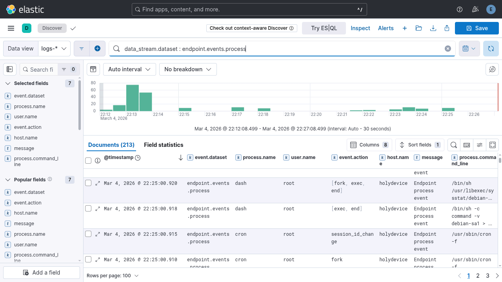

# Elastic SIEM + EDR SOC Lab

## Project Highlights

- Built a **single-node SOC lab** using the Elastic Stack (Elasticsearch, Kibana, Elastic Agent).
- Collected and analyzed **endpoint telemetry using Elastic Defend**.
- Performed **threat hunting using KQL queries** and created a custom detection rule for network scanning activity.
- Simulated attacker behavior using **nmap reconnaissance and privilege escalation commands**.
- Investigated alerts and endpoint activity through **Kibana Discover and Security dashboards**.

## Overview

This project demonstrates a **single-node Security Operations Center (SOC) lab** built using the Elastic Stack.  
The lab collects endpoint telemetry from a Linux system using **Elastic Agent and Elastic Defend**, ingests it into **Elasticsearch**, and allows security investigation and detection engineering through **Kibana**.

The goal of this project was to understand how SOC analysts:

- Monitor endpoint activity
- Perform threat hunting
- Investigate suspicious behavior
- Build detection rules

---

## Architecture


---

## Environment

| Component | Details |
|----------|--------|
| OS | Kali Linux |
| RAM | 8 GB |
| Elastic Stack | 8.19.11 |
| Deployment Type | Single-node SOC Lab |

### Components Used

- Elasticsearch
- Kibana
- Fleet Server
- Elastic Agent
- Elastic Defend

---

## Telemetry Collected

### System Telemetry

- system.auth
- system.syslog
- system.process
- system.cpu
- system.memory

### Endpoint Telemetry (Elastic Defend)

- endpoint.events.process
- endpoint.events.network
- endpoint.events.file
- endpoint.events.security


Example endpoint telemetry visible in **Kibana Discover**.



---

## Attack Simulation

To generate security telemetry, several attacker behaviors were simulated.

### Reconnaissance

```bash
whoami
id
uname -a
```

### Privilege Activity

```bash
sudo -l
sudo ls /root
sudo cat /etc/shadow
```

### Network Scan

```bash
nmap localhost
```

### Suspicious File Activity

```bash
touch suspicious_file.txt
echo "test" > suspicious_file.txt
rm suspicious_file.txt
```
These activities generated endpoint telemetry that was ingested into Elasticsearch.

---

## Data Ingestion Verification

After deploying **Elastic Agent** and enabling **Elastic Defend**, endpoint telemetry was verified using **Kibana Discover**.

**Query used**
```kql
data_stream.dataset : endpoint.events.process
```

This query confirms that endpoint process telemetry is successfully being ingested into Elasticsearch.


---

## Investigation in Kibana

Security investigations were performed using **Kibana Discover** to analyze endpoint telemetry.

### Process Monitoring

**Query used**
```kql
data_stream.dataset : endpoint.events.process
```

This query displays all process execution events captured by Elastic Defend.


---

### Detecting Network Scanning

**Query used**
```kql
process.command_line : nmap
```

This query identifies command-line executions containing **nmap**, which may indicate reconnaissance activity.


---

### Privilege Escalation Activity

**Query used**
```kql
process.name : sudo
```

This query helps identify commands executed with elevated privileges.


---

### File Activity Monitoring

**Query used**
```kql
data_stream.dataset : endpoint.events.file
```

This query shows file creation, modification, and deletion events captured by Elastic Defend.


---

### Network Telemetry

**Query used**
```kql
data_stream.dataset : endpoint.events.network
```

This query displays network connection activity generated by endpoint processes.


---

## Detection Rule

A custom detection rule was created to identify **network scanning behavior**.

### Rule Name

Network Scanning Detection

### Rule Query
```kql
process.name : nmap
```
### Index Pattern

logs-*

After executing the following command:

```bash
nmap localhost
```
The rule successfully generated an alert in Kibana.

## Results

The SOC lab successfully demonstrated a complete **security monitoring workflow**, including:

- Endpoint telemetry collection  
- Centralized log ingestion using Elasticsearch  
- Threat hunting using Kibana queries  
- Detection rule creation  
- Alert generation and investigation  

---

## Skills Demonstrated

- Elastic Stack deployment  
- SIEM log ingestion  
- Endpoint telemetry analysis  
- Threat hunting using KQL  
- Detection engineering  
- SOC investigation workflow  

---

## Key Investigation Queries

```kql
data_stream.dataset : endpoint.events.process
process.command_line : *nmap*
process.name : sudo
data_stream.dataset : endpoint.events.file
data_stream.dataset : endpoint.events.network
```

---

## Future Improvements

Possible improvements to the lab include:

- Simulating **brute-force authentication attacks** to test login monitoring and detection rules  
- Creating **additional detection rules** for suspicious process execution and privilege escalation  
- Integrating **threat intelligence feeds** to enrich detection capabilities  
- Adding **multiple monitored endpoints** to simulate a small enterprise environment  
- Implementing **alert response workflows** to demonstrate incident response procedures  

---

## Conclusion

This project demonstrates how a SOC analyst can use **Elastic SIEM and Elastic Defend** to monitor endpoint activity, investigate suspicious behavior, and build detection rules.

By simulating attacker behavior and analyzing the resulting telemetry in Kibana, the lab provides hands-on experience with:

- Endpoint telemetry monitoring  
- Threat hunting using KQL queries  
- Detection rule engineering  
- Alert investigation within a SIEM environment  

The lab serves as a practical environment for developing **SOC investigation and detection engineering skills using the Elastic Stack**.

---
